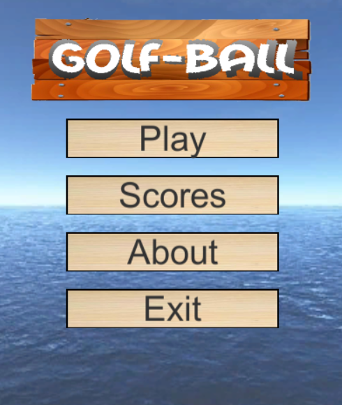
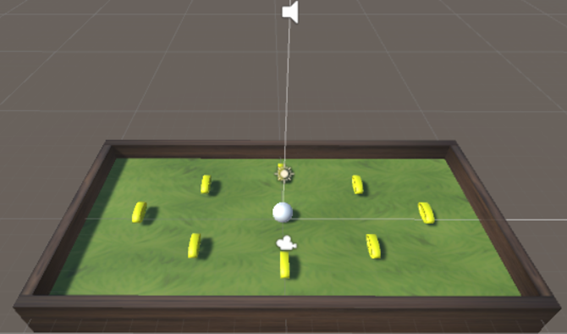
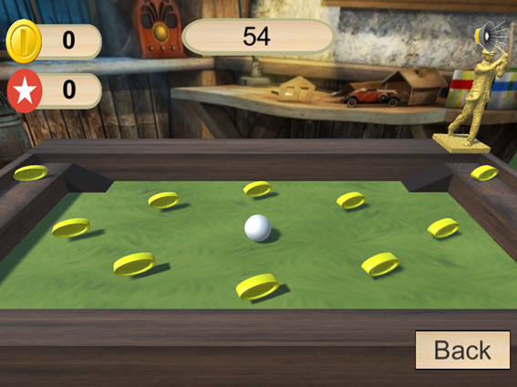
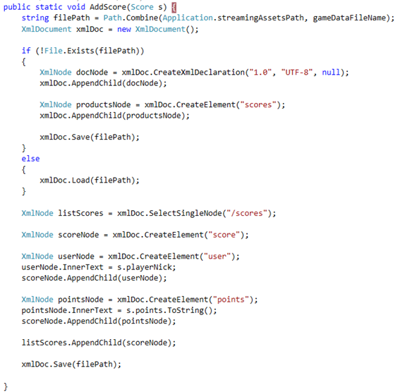
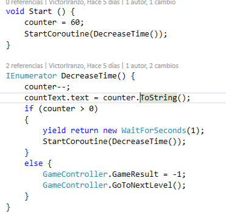

# SMM_Practice2
(Developed during the CS Degree) A very simple Unity game in 3-dimensions that consists on rolling the ball using the keyboard arrows to collect all the pick ups.

The game looks like a golf game where the player is the ball in a world of grass circled by wood walls. 

# Screenshots and video
Video: https://www.youtube.com/watch?v=jCAYyAXVOPc

# Improvements
The game is based on a basic tutorial of Unity with some improvements:

- A new step has been added to the world. It is accessible using 2 ramps, that have been done using Paint3D.
- Using the ramp the player can fall down from the world. A plane has been added with a tag, and a trigger collider. So when the ball touches it, the game is restarted.
- Countdown added.
- Points and coins now are different thing. The points depend on how fast you collect the coins.
- Added Scores, About and Resume menus. For the Scores view a XML file is persisted in the StreamingAssets folder and only the 3 top scores are shown.
- Using the ramp the player can fall down from the world. In this case, a Gameover message appears. This occurs also when the countdown arrives to 0 and not all the coins have been collected.
- The music can be muted from the game window.
- From the previous version, a new Skybox is used for the game view. It looks like a toy workshop. I have built the skybox from an image, so it doesn't fit so well in the corners.
- All the buttons and panels look like a wood style.
- Added a golf player figure in the main scenario with a gold look.

When a click to the sound icon is done, the boolean of the animator changes and a transition occurs to the contrary image while the music is paused.

The StreamingAssets exists in every platform where the game is executed. If the XML file of the data doesn't exists, it's created. The XML structure is the attached. All values are wrapped in nodes. This is better that using a single node for each score with attributes for user nick and points.

While the counter is positive, a call to the DecreaseTime routine is done recursively. After waiting one second and updating the Text UI element, the next call is done. If the counter arrives to 0, a Gameover is shown.

The data.xml file is read. From the XML we get all the childs of "scores" node. Each one is deserialized in a Score object. Then, the list of scores is ordered using LINQ and only the 3 highest in points are returned in a list.
